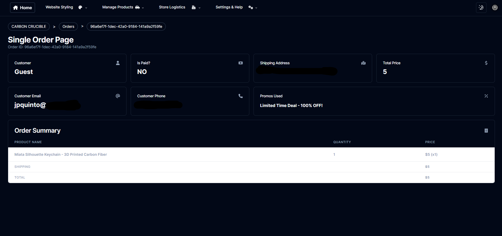

# The Ultimate Ecommerce Dashboard

This is a full write up for my All-in-1 Ecommerce Dashboard project. The goal of this project was to create a fully functioning ecommerce website dashboard, where managers can manage products, create promos, style their ecommerce website, and handle many other processes without knowing any coding knowledge.

The dashboard has many features, allowing managers to:
- Create new Products, adjust their attributes, and see insights on the Product's performance on the site (sales, reviews, etc)
- View a list of the Orders in the store in a nice data table, with organizational filters (paid, shipped, fulfilled)
- Create new Categories and Materials, so that customers can sort by certain filters when browsing products
- Style the homepage of the website, add social media posts to the website, and create billboards to show on the top of other pages
- See a list of all Custumer accounts on the store page (list of customers who have created an account on the main page), and take a look at their attributes (order history, contact info, etc)
- Create and manage Promos, which will automatically activate and expire at given times, and will apply discounts to certain items
- Send transactional emails that trigger once users sign-up or make orders

The dashboard is meant to be a companion for an actual Ecommerce Website, which I also developed. Making edits to the dashboard will directly update the actual ecommerce website!

I created the dashboard to manage an actual website, [The Carbon Crucible](https://thecarboncrucible.com). This website uses the same tech stack as the dashboard, and also implements the USPS shipping API to verify shipping addresses and get shipping rates. Right now, the Ecommerce Dashboard only works for that website. I plan on creating a public demo version with dummy data, and in the future maybe releasing a version where anybody can use the website to create their own ecommerce website. 

---
## Entities
There are many entities that can be created in our database for the store:
- Heroes
- Billboards
- Social Media Posts
- Categories
- Materials
- Products
- Orders
- Reviews
- Customers
- Promos
An entity is just an entry in the database of any type. For most of these, the manager/administrator can create, update, and delete these entities. 

Of course, if you're just an admin/manager, you don't need to know everything about how the database works, but here are some basics: Every entity in the database has a unique `id` attribute, which is a long string of random characters that is auto-generated when the entity is first created. This may not be important for admin/managers, but if you are a developer or tester, editing the code of the store page, you may need to work with these. 

---
# Dashboard Pages
We will now go over all of the individual pages on the dashboard.

## Overview/Homepage
The **Overview/Homepage** is a good place to get all of the important information on your store in one place. 

It gives the plain statistics of:
- Total revenue of the store (this doesn't include shipping rates, just the total of product prices)
- Total amount of sales (paid orders)
- Total amount of products that are in stock (not the total inventory, just the amount of products that are in stock)
- Total amount of users that have signed up on the store page
- Total amount of reviews left by customers

It then shows a dynamic graph that shows monthly revenue.

At the bottom of the page, you have some interesting cards:
- **Inventory Overview**: shows a list of all the products in the store, as well as the quantity of each that we have in stock
- **Recent Orders**: shows a quick overview of the most recent orders placed in the store
- **Promo Timeline**: a quick timeline of the promotions that are coming up or have ended in the last 7 day

---
## Website Styling
The Website Styling section has 4 tabs:
- Heroes
- Billboards
- Social Media (Posts)
- Styling

These tabs are where you can edit the looks of your website. 

### Heroes
The **Heroes** tab lets you create `Heroes` for your website. A **hero** is the thing that takes up the entire screen when you enter the home page. 

Here, you can choose the `Heroes` that will shows up on the rotating gallery on the home page. (Yes, technically, there is only one "Hero" for the home page, and all the "Heroes" you create are just part of that one Hero. But for the sake of simplicity, I just called each individual part a "Hero")

On this tab, you can view/delete all your Heroes, and set them as `Active/Inactive`. Only active heroes will show up on the store page. 

There is also a designated `Order` that you can set up for the `Heroes` to show up in. So, evidently, the first thing a user will see when the go to the website is the `Hero` with the `Order` set to `1`.

You can have as many `Heroes` active as you want, just keep in mind that you don't want *too* many there. 

### Billboards
The **Billboards** tab lets you create and edit `Billboards` for your website. These are the big pictures that show up on the top of the shop page, as well as individual `Category` pages. Note that any `Category` must be tied to a specific `Billboard`, so you **must** create a `Billboard` before you create a `Category`.

On this page, you can choose which of your `Billboards` is `inShop`, which means it is the sole `Billboard` at the top of the main shop page. Be sure to pick a nice picture!

### Social Media Posts
The **Social Media** tab lets you create and edit `Social Media Posts`. These show up *at the bottom on the main store page*. A future update may allow you to also put these on the `Social` or `Blog` page of the store. 

Note that **for the moment**, `Social Media Posts` can only be Tik Toks. 

All you have to put for these is the URL to the Tik Tok. You can easily find this by going to the Tik Tok website and finding the post you want. Please be sure to **test** that this link works before you create the post, or it could break the website. 

To make the post show up on the main store page, make sure to set `inShop` to true.

It's important to note that the main store page shows *up to* 4 of these `Social Media Posts`, and it takes the most recent ones. So keep this in mind when updating them.

### Styling
The **Styling** tab allows users to configure some styling on the website. It allows for full customization of the `Heroes`, and allows you to choose which `Billboard` to appear in the shop.

In future updates, the **Styling** tab may allow for:
- Picking accent colors and other styling options on the website
- Choosing `Billboards` for the `About` or `Terms and Conditions` page
- More!

---
## Manage Products
The Manage Products section has 3 tabs:
- Categories
- Materials
- Products

**Note**: You CANNOT create a new `Product` if you haven't created at least one `Category` or `Material`. Also, you CANNOT create a `Category` until you've created at least one `Billboard`.

### Categories
The `Categories` tab allows you to view, create, edit, and delete your `Categories`. These categories are one of the two major **filters** of your products. Along with `Materials`, users can sort by `Category` on the main shop page to narrow down the list of `Products`. The `Category` and the `Material` will also show up in every description of each `Product` on the store page.

To create a new `Category`, you just need to provide a name for it, as well as the specific `Billboard` it is tied to. Each `Category` needs a `Billboard` because each individual `Category` page on the store website will have a `Billboard` at the top. You'll find that you won't be able to create a `Category` without creating a `Billboard` first. 

### Materials
The `Materials` tab allows you to view, create, edit, and delete your `Categories`. This is pretty straightforward, you just need to provide a name for the material. 

### Products
Now we can look at the heart and soul of your business, the `Products`. 

The `Product` is the most complicated entity of anything on this website, so let's go over every property that each `Product` has:
- `name`: The name of the product
- `category`: The `Category` of the product
- `material`: The `Material` of the product
- `price`: The price of the product
- `isFeatured`: If true, then this product will show up on the **main homepage** in the "Featured Products" section
- `isArchived`: If true, then this product won't show up **anywhere** on the store website. Users will not be able to buy this product if archived. Note that this can be changed at any time
- `images`: The images showing off the product. It is good to upload multiple for each
- `description`: The description of the product
- `stock`: The number of this product that you have in inventory. Keep in mind that this does update dynamically when someone orders it, so you don't have to update it manually each time. But you can update it manually when you lose/create more stock
- `pounds` and `ounces`: The weight of the product. Note that this is ONLY for calculating the shipping rate. This will not be displayed to customers (unless we want to)

Everything listed above **MUST** be filled out when initially creating a `Product`. There are also some other properties that get updated automatically after the `Product` has been released:
- `numSold`: the amount of this product that has been sold
- `reviews`: the list of reviews written for this product
- `avgRating`: the average review rating of the product

So yeah, there's a lot that goes into creating a new product. But... what do you expect for the heart and soul of your business... right?

The `Products` tab allows you to create, update, delete, and view your products. You can change any of the attributes above (besides the number sold, reviews, and average ratings, as those are updated by customers). 

You can also navigate to an individual `Product`'s page, where you can edit that product, as well as see some insights on the `Product`. The insights will show the number sold, and a list fo the `Reviews` left for that product. 

---
## Store Logistics
The **Store Logistics** section is for managing the business. Theres:
- Orders
- Reviews
- Promos
- Customers

### Orders
The **Orders** tab is where you can view all of your orders and update their status. 

There are 3 main status updates for an order:
- Paid
- Shipped
- Fulfilled

You CANNOT edit the `isPaid` attribute of an order (of course). Note that unpaid orders will show up on the `Orders` tab anyway, just so we can see what people are putting in their cart. If it isn't obvious, DO NOT prepare an order that isn't paid. You can pretty much ignore them altogether if you don't care about seeing what people put in their cart. 

The `isShipped` and `isFulfilled` is for our tracking and organizational purposes only. As of right now, customers will not be updated on these status updates. This is just to make tracking orders on our side much easier. In a future update, these may be updated automatically, but for right now, you must **manually update** these values. 

The `Orders` tab will show the status of each order, the customer's name (or "Guest"), the total price (NOT including shipping), the list of products, the shipping address for the order, and the date it was placed. 

Navigating to an individual `Order`'s page will give you a more in-depth summary of the order, as well as a form to update the status (if it is paid for). It will also show you the promos that were used in that `Order`.

### Reviews
The **Reviews** tab is where you can see all of the reviews for your store.

It is important to note that ONLY registered Customers (people who have created an account) can write reviews. Furthermore, Customers can only write reviews if they have already bought the product, and of course, can only write one review per product. 

### Promos
The **Promos** tab is where you can create, edit, and see the promos for the store.

There are two types of `Promo` you can create:
- Promo Codes: to activate these promotions, users must input the specific code for them. Once the code is activated, the promo will apply the discount to the items that are in the cart. 
- "Universal Promos": these are promotions that are **automatically** applied to the given items in the store. Customers DO NOT need to input a code for these. The effects of these promotions will be visible for every product in the store when the page is loaded

To create a promo code, put `hidden` to TRUE when creating the promo. To create a universal promo, put `hidden` to FALSE when creating the promo.

An important thing to note is that for any **single item** in a user's cart, **only one promo can be applied at a time**, and the website will choose the one with the HIGHEST discount if more than one are applicable to a product. Note that, however, a customer CAN have multiple promos applied to an entire order.

For example, if a universal promo "HALF OFF SALE" applies a 50% discount to `Product X` and `Product Y`, and promo code "BLACKFRIDAY25" applies a 25% discount to `Product Y` and `Product Z`, then:
- `Product X` will be 50% off
- `Product Y` will be 50% off
- `Product Z` will be 25% off

When creating a new `Promo`, you will have to specify the `startsAt` and `expiresAt` date for the promo. Of course, the `Promo` will only be usable between those dates. 

The `name` and `description` fields for the `Promo` are really just for organizational purposes. 

### Customers
The **Customers** tab allows you to see the users that have created an account on the store page. Right now, it is required for anyone who signs up to include their `name` and their `email`, so you'll see those here, along with the number of orders they have placed, the number of reviews they have left, and the date they joined. 

Going to an individual `Customer`'s page will give a more in-depth look at their profile, showing you more of their information, as well as a detailed table of the `Orders` they have placed and the `Reviews` they have written. 

---
## Settings and Help

### Settings
The **Settings** page allows you to configure certain settings for the site.

The `name` is only shown on the dashboard. 

### Help
The **Help** page contains the same documentation that you see on this page. 

---
## Disclaimer
This project was built off of a tutorial by Antonio Erdeljac. While I did add a LOT of different features from the tutorial, a lot of the starter code for this project (and the store page) is from that tutorial.
